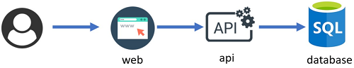

# Challenge 09 - AKS Network Integration and Private Clusters

[< Previous Challenge](./Challenge-08-datavolumes.md) - **[Home](../README.md)** - [Next Challenge >](./Challenge-10-secrets.md)

## Introduction

This challenge will cover deployment of an AKS cluster fully integrated in a Virtual Network as well as deploying the sample app, and configuring ingress. 

Make sure to check the optional objectives if you are up to a harder exercise.

## Description

The sample application we will use in this hack has three components, as the following picture describes: 

The web & API components are documented at the links below. Use this documentation for hints on how to deploy them and how they work:
- A [Web](./Resources/Challenge-09/web) component that offers an HTML portal that shows the information.
- An [API](./Resources/Challenge-09/api) component that accesses a backend database.
- An Azure SQL Database which is only used to return a simple query that shows the database version.

You need to fulfill these requirements to complete this challenge

### Build & Publish Containers to Azure Container Register

Look in the `/api` and `/web` folders in the resources to find the source code for the sample application we will use for this hack. You will find a Dockerfile in each folder that you can use to build container images for the API and Web components.

- Create an Azure Container Registry. 
- Build the API and Web container images and store them in your new ACR.

### Deploy an AKS Cluster

- Deploy an AKS cluster integrated in an existing VNet (you need to create the VNet in advance)
- Deploy as few nodes as possible
- If you completed the previous section with ACR, attach the cluster to the Azure Container Registry you created.

**NOTE:** If you do not have "Owner" permissions on your Azure subscription, you will not have permission to attach your AKS cluster to your ACR.  We have staged the sample application on Docker Hub so that you can use the container images at these locations:
- **API app:** `whatthehackmsft/api:1.0`
- **Web app:** `whatthehackmsft/web:1.0`

**HINT:** If you decide to use your own ACR with the images for api and web, you must fully qualify the name of your ACR. An image with a non-fully qualified registry name is assumed to be in Docker Hub. 

### Deploy the sample application

- Deploy an Azure SQL Database.
- Deploy the API and Web containers, expose them over an ingress controller (consider the Application Gateway Ingress Controller, although it is not required). 
- Make sure the links in the section `Direct access to API` of the web page exposed by the Web container are working, as well as the links in the Web menu bar (`Info`, `HTML Healthcheck`, `PHPinfo`, etc)

## Success Criteria

- Verify the application is reachable over the ingress controller, and the API can read the database version successfully
- Verify the links in the `Direct access to API` section of the frontend are working

## Advanced Challenges (Optional)

- Make sure the AKS cluster does not have **any** public IP address
- Configure the Azure SQL Database so that it is only reachable over a private IP address

## Learning Resources

These docs might help you achieving these objectives:

- [Create a private AKS cluster](https://learn.microsoft.com/en-us/azure/aks/private-clusters?tabs=azure-portal)
- [Azure Private Link](https://docs.microsoft.com/azure/private-link/private-link-overview)
- [Restrict AKS egress traffic](https://docs.microsoft.com/azure/aks/limit-egress-traffic)
- [Azure SQL Database](https://docs.microsoft.com/azure/azure-sql/azure-sql-iaas-vs-paas-what-is-overview)
- [AKS Overview](https://docs.microsoft.com/azure/aks/)
- [Application Gateway Ingress Controller](https://docs.microsoft.com/azure/application-gateway/ingress-controller-overview)
- [Create an Nginx ingress controller in AKS](https://docs.microsoft.com/azure/aks/ingress-basic?tabs=azure-cli)
- [Web Application Routing Addon](https://docs.microsoft.com/azure/aks/web-app-routing)